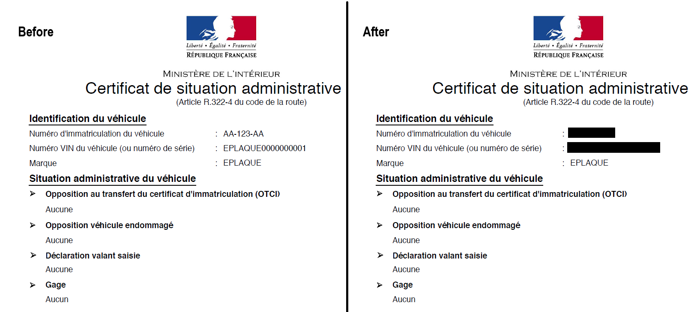
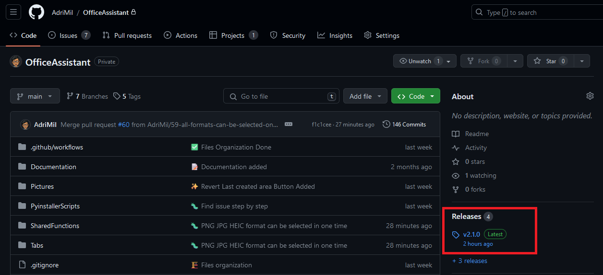
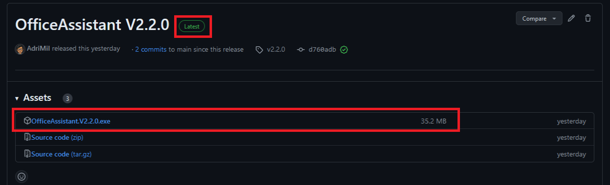
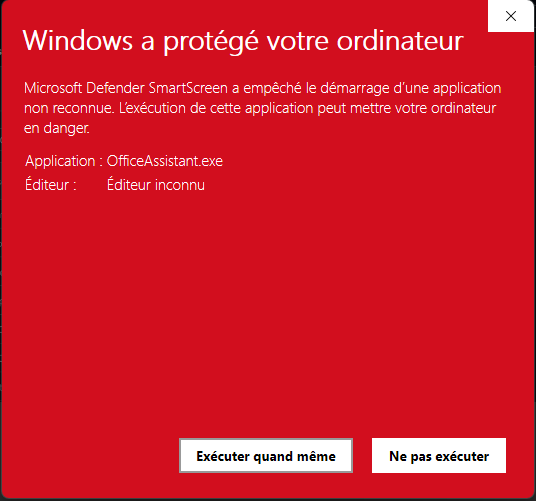

# Office Assistant

First project to gain skills in Python, git, project management and as well answer to my need. Code is not perfectly optimized. Some refacto code session need to be performed. I did not spend time on User Interface, i like minimalist aspect.  

## Tab1-PdfCreator

### Goal
Merge your pictures to create 1 pdf file without load them on internet, all operations are performed localy. Your data are protected. Compatible pictures formats are PNG, JPG and HEIC (iphone pictures) 

### Application exemple
You scanned 15 invoices and you want gather them in 1 files. In few clicks load all your scanned pictures, modify pictures order and create a pdf ! 

### Notes
- Differents pictures formats can be added at the same time.
- Order of loaded pictures can be easily modify thanks Up and Down arrows.
- Loaded pictures can be delete one by one using the bottom Trash button. 
- Loaded pictures can be delete in 1 clic with Trash button.
- When your pictures are loaded and well ordered, you can create your pdf file by selecting "Convert" button.
    * You must add a title
    * And select the path where you want save the new pdf

## Tab2 - Picture Obfuscation

### Goal
Hide parts of a pictures by drawing a rectangles on zone you want keep secret.
All operations are performed localy, without internet. Your data are protected.
Compatible pictures formats are PNG, JPG and HEIC (iphone pictures) 

### Application exemple
You scanned 1 document you must share to your colleague but your personal adress is visible. Draw a rectangle above area where your adress is visible and save. You can now send your new obfuscated picture.

### Notes
- Differents pictures formats can be loaded.
- By saving, a new picture is created in the same format as original one and without loss of quality.
- When saving, the picture is save in the same folder as the original one, with the same name but ending by "- obfuscated"
- You can delete rectangle one by one by using the "Revert" Arrow from the bottom
- You can delete drew rectangles one by one by using the "Revert" Arrow from the bottom
- You can delete all drew rectangles in one click with Trash button
- Zoom buttons appears but cannot be used for the moment.

## Installation

1- From Github last release : 

2- Download "OfficeAssistant.Vx.y.z.exe" file

3- Execute the .exe file you downloaded from step before 

**WARNING** : As I do not have (yet) security certification, **your firewall will send a Warning message at the .exe execution**. See exemple below : 

Go through this warning by clicking on "Execute Anyway". 

## Get .exe file Process 
For Dev purpose, below is the process to get .exe one file

