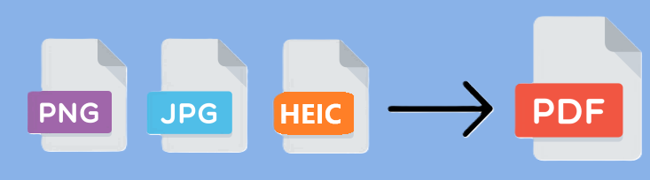

# Office Assistant
Earn some time by using this minimalist interface for your administrative topics. 
All operations are performed localy. You do not have to share your personals documents on internet anymore. 

Code is not perfectly optimized. 

Language switching is available within the user interface. Available languages are French, English, Spanish and German.

## Tab1-PdfCreator


### Goal
Merge your pictures to create 1 pdf file. 
Compatible pictures formats are PNG, JPG and HEIC (iphone pictures) 

### Application exemple
You scanned 15 invoices and you want gather them in 1 files. In few clicks load all your scanned pictures, modify pictures order and create a pdf ! 

### Notes
- Differents pictures formats can be added at the same time.
- Loaded pictures order can be easily modify thanks Up and Down arrows.
- Loaded pictures can be delete one by one using the bottom Trash button. 
- Loaded pictures can be deleted in 1 clic with Trash button.
- When your pictures are loaded and well ordered, you can create your pdf file by selecting "Convert" button.
    * You must add a title
    * And select the path where you want save the new pdf

## Tab2 - Picture Obfuscation


### Goal
Hide parts of a picture by drawing a rectangle on zone you want keep secret.
Compatible pictures formats are PNG, JPG and HEIC (iphone pictures) 

### Application exemple
You scanned 1 document you must share to your colleague but your personal adress is visible. Draw a rectangle above areas where your adress is visible and save. You can now send your new obfuscated picture.

### Notes
- Differents pictures formats can be loaded.
- By saving, a new picture is created in the same format as original one and without loss of quality.
- When saving, the picture is save in the same folder as the original one, with the same name but ending by "- obfuscated"
- You can delete rectangle one by one by using the "Revert" Arrow from the bottom
- You can delete drew rectangles one by one by using the "Revert" Arrow from the bottom
- You can delete all drew rectangles in one click with Trash button
- Zoom buttons appears but cannot be used for the moment.

## Installation

1- From Github last release : 


2- Download "OfficeAssistant.Vx.y.z.exe" file

Be sure you selected  the latest release version, which is display by the green information (see picture below).
And download .exe file


3- Execute the .exe file you downloaded from step before 

**WARNING** : As I do not have security certification, **your firewall will send a Warning message at the .exe execution**. See exemple below : 


Go through this warning by clicking on "Execute Anyway". 


  
<br />
<br />

# Only for Devs/Contributors
## Get .exe file Process 
Process to get .exe one file


## SonarQube analysis process
SonarQube server is running with docker on my local computer.

### SonarQube Server
Create volumes to keep your analysis in case of SonarQube container reboot : 
```console
docker volume create sonarqube_data
docker volume create sonarqube_extensions
```

Run sonarqube:community container :
```console
docker run -d --rm --name sonarqube  -p 9000:9000  -v sonarqube_data:/opt/sonarqube/data -v sonarqube_extensions:/opt/sonarqube/extensions  sonarqube:community
```

### Link your project
Within SonarQube server UI, link your local repositry where .git file from this project is.
Keep information like Token, PROJECT_KEY for next step.

### Run Alanysis
Run following command to analyse your project
```console
docker run --rm -e SONAR_HOST_URL="http://host.docker.internal:9000"  -e SONAR_SCANNER_OPTS="-Dsonar.projectKey=**PROJECT_KEY**" -e SONAR_TOKEN="**YOUR_TOKEN**" -v "**PROJECT_LOCAL_FOLDER**:/usr/src" sonarsource/sonar-scanner-cli
```
### Results  
All results will be displayed in SonarQube web UI. 
